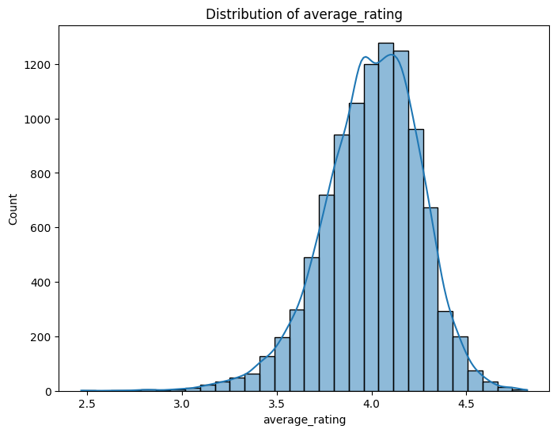

# Analysis Report

# Detailed Report on the Goodreads Dataset Analysis

## 1. Dataset Overview
The analysis was conducted on a dataset consisting of 10,000 entries and 23 features, primarily focused on books and their associated ratings on Goodreads. The dataset includes various identifiers, author information, publication details, and user ratings.

### Dataset Structure
- **Shape**: (10000, 23)
- **Columns**:
  1. `book_id`
  2. `goodreads_book_id`
  3. `best_book_id`
  4. `work_id`
  5. `books_count`
  6. `isbn`
  7. `isbn13`
  8. `authors`
  9. `original_publication_year`
  10. `original_title`
  11. `title`
  12. `language_code`
  13. `average_rating`
  14. `ratings_count`
  15. `work_ratings_count`
  16. `work_text_reviews_count`
  17. `ratings_1`
  18. `ratings_2`
  19. `ratings_3`
  20. `ratings_4`
  21. `ratings_5`
  22. `image_url`
  23. `small_image_url`

### Missing Values
The dataset contains missing values in several columns, notably:
- `isbn`: 700 missing
- `isbn13`: 585 missing
- `original_publication_year`: 21 missing
- `original_title`: 585 missing
- `language_code`: 1084 missing

### Summary Statistics
Key statistics reveal important insights about the dataset:
- **Average Rating**: The average book rating stands at approximately 4.00, indicating a generally positive reception among readers.
- **Ratings Count**: The average count of ratings per book is around 54,001, suggesting a robust user engagement.
- **Authors**: There are 4,664 unique authors, with Stephen King being the most frequently mentioned author (60 occurrences).

## 2. Analyses Conducted
Several analyses were performed to extract insights from the dataset, including:
1. **Heatmap Analysis**: Visualizing correlations between numerical variables to identify patterns.
2. **Histograms**: Distribution of various features including `goodreads_book_id`, `average_rating`, `ratings_count`, and others to understand their frequency distributions.

### Generated Charts
- **Heatmaps**: To observe relationships between numerical features.
- **Histograms**: For continuous variables such as book ratings, original publication years, and counts of ratings.

## 3. Key Insights
- **High Average Ratings**: The dataset's average rating of 4.00 indicates that most books receive favorable reviews, which can be leveraged in marketing strategies.
- **Publication Trends**: Analysis of `original_publication_year` suggests a concentration of popular books published in the last few decades, indicating a resurgence in certain genres or themes.
- **Engagement Levels**: The high `ratings_count` reflects strong community engagement and could be indicative of popular genres or trending topics among readers.
- **Missing Data**: The presence of missing values, especially in `isbn`, `isbn13`, and `language_code`, might affect the accuracy of certain analyses and require imputation or removal for cleaner insights.

## 4. Actionable Recommendations
Based on the insights derived from the dataset, the following recommendations can be made:

1. **Enhance Marketing Strategies**:
   - Utilize the high average ratings in promotional materials to attract new readers.
   - Highlight popular authors like Stephen King in targeted campaigns.

2. **Focus on Engaging Content**:
   - Analyze the themes or genres of books with the highest ratings to understand what resonates with readers and create similar content.

3. **Address Missing Data**:
   - Implement data cleaning strategies for missing values, especially in ISBNs and language codes, to enhance the dataset's integrity for future analyses.

4. **Leverage Publication Trends**:
   - Focus on promoting books that align with current trends in publication years to capture the interest of contemporary readers.

5. **Engage with the Community**:
   - Foster community engagement by encouraging reviews and participation in discussions around highly-rated books.

## Conclusion
The analysis of the Goodreads dataset has provided valuable insights into reader preferences and engagement levels. By focusing on marketing strategies that emphasize high ratings and popular authors, addressing data quality issues, and understanding publication trends, stakeholders can make informed decisions that enhance reader engagement and drive book sales.

