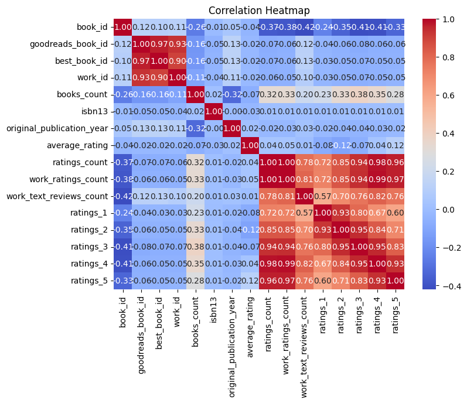

# Analysis Report

### Summary of the Goodreads Dataset

The dataset contains information about 10,000 books from Goodreads, with 23 columns detailing various attributes such as book identifiers, authors, publication years, ratings, and reviews. Key columns include `authors`, `average_rating`, `ratings_count`, and `original_publication_year`. 

### Key Insights

1. **Missing Values**: 
   - The dataset has missing values in several columns. Notably, `isbn` (700 missing), `isbn13` (585 missing), `original_publication_year` (21 missing), `original_title` (585 missing), and `language_code` (1,084 missing) have significant gaps. This may limit the analysis on certain books, especially when ISBNs are required for linking to external databases or when analyzing the language distribution.

2. **Authors**: 
   - The dataset features 4,664 unique authors, with Stephen King being the most frequently mentioned author (60 occurrences). This highlights the dataset's diverse range of authors but also suggests a potential over-representation of certain popular authors.

3. **Publication Years and Trends**:
   - The average original publication year of the books is approximately 1982, with a range from -1750 to 2017. This indicates a historical breadth in the dataset, capturing both classic and contemporary literature.

4. **Ratings and Reviews**:
   - The average rating across books is approximately 4.00, suggesting that many books are well-rated. The ratings distribution is skewed, with a significant number of 5-star ratings (23,789 average), indicating a tendency for users to rate books positively.
   - The `ratings_count` has a mean of about 54,001, suggesting that most books have received considerable user engagement.

5. **Language Distribution**:
   - There are 25 unique language codes, with a dominant presence of English (top language with 6,341 occurrences). However, 1,084 entries have missing language codes, which could skew language representation.

### Recommendations

1. **Data Cleaning**:
   - Address the missing values by either imputing them where reasonable or removing rows/columns that are excessively incomplete. Special attention should be given to the `isbn` and `isbn13` fields due to their importance in identifying books accurately.

2. **Author Diversity**:
   - Consider exploring the representation of authors in the dataset. An analysis could be performed to determine if certain genres or demographics are underrepresented. This could be useful for recommendations or targeted marketing.

3. **Yearly Trends**:
   - Conduct a trend analysis of publication years to visualize how the popularity and ratings of books have changed over time. This could provide insights into literary trends and reader preferences.

4. **Language Analysis**:
   - Investigate the impact of language on ratings and reviews. Understanding how books in different languages are rated could provide valuable insights into cultural preferences and translation quality.

5. **User Engagement**:
   - Explore the correlation between `ratings_count` and `average_rating` to understand if more popular books tend to receive higher ratings. This could inform marketing strategies for new books.

### Visualizations Suggested
- **Bar Charts** showing the distribution of ratings (1 to 5 stars).
- **Histograms** for original publication years to illustrate the age distribution of the books.
- **Pie Charts** for the language distribution to visualize the diversity of languages in the dataset.
- **Scatter Plots** correlating `ratings_count` with `average_rating` to visually assess user engagement and satisfaction.

This analysis provides a comprehensive overview of the dataset, highlighting areas for further exploration and actionable insights for potential applications.

## Sample Data

|   book_id |   goodreads_book_id |   best_book_id |   work_id |   books_count |      isbn |      isbn13 | authors                     |   original_publication_year | original_title                           | title                                                    | language_code   |   average_rating |   ratings_count |   work_ratings_count |   work_text_reviews_count |   ratings_1 |   ratings_2 |   ratings_3 |   ratings_4 |   ratings_5 | image_url                                                  | small_image_url                                            |
|----------:|--------------------:|---------------:|----------:|--------------:|----------:|------------:|:----------------------------|----------------------------:|:-----------------------------------------|:---------------------------------------------------------|:----------------|-----------------:|----------------:|---------------------:|--------------------------:|------------:|------------:|------------:|------------:|------------:|:-----------------------------------------------------------|:-----------------------------------------------------------|
|         1 |             2767052 |        2767052 |   2792775 |           272 | 439023483 | 9.78044e+12 | Suzanne Collins             |                        2008 | The Hunger Games                         | The Hunger Games (The Hunger Games, #1)                  | eng             |             4.34 |         4780653 |              4942365 |                    155254 |       66715 |      127936 |      560092 |     1481305 |     2706317 | https://images.gr-assets.com/books/1447303603m/2767052.jpg | https://images.gr-assets.com/books/1447303603s/2767052.jpg |
|         2 |                   3 |              3 |   4640799 |           491 | 439554934 | 9.78044e+12 | J.K. Rowling, Mary GrandPré |                        1997 | Harry Potter and the Philosopher's Stone | Harry Potter and the Sorcerer's Stone (Harry Potter, #1) | eng             |             4.44 |         4602479 |              4800065 |                     75867 |       75504 |      101676 |      455024 |     1156318 |     3011543 | https://images.gr-assets.com/books/1474154022m/3.jpg       | https://images.gr-assets.com/books/1474154022s/3.jpg       |
|         3 |               41865 |          41865 |   3212258 |           226 | 316015849 | 9.78032e+12 | Stephenie Meyer             |                        2005 | Twilight                                 | Twilight (Twilight, #1)                                  | en-US           |             3.57 |         3866839 |              3916824 |                     95009 |      456191 |      436802 |      793319 |      875073 |     1355439 | https://images.gr-assets.com/books/1361039443m/41865.jpg   | https://images.gr-assets.com/books/1361039443s/41865.jpg   |
|         4 |                2657 |           2657 |   3275794 |           487 |  61120081 | 9.78006e+12 | Harper Lee                  |                        1960 | To Kill a Mockingbird                    | To Kill a Mockingbird                                    | eng             |             4.25 |         3198671 |              3340896 |                     72586 |       60427 |      117415 |      446835 |     1001952 |     1714267 | https://images.gr-assets.com/books/1361975680m/2657.jpg    | https://images.gr-assets.com/books/1361975680s/2657.jpg    |
|         5 |                4671 |           4671 |    245494 |          1356 | 743273567 | 9.78074e+12 | F. Scott Fitzgerald         |                        1925 | The Great Gatsby                         | The Great Gatsby                                         | eng             |             3.89 |         2683664 |              2773745 |                     51992 |       86236 |      197621 |      606158 |      936012 |      947718 | https://images.gr-assets.com/books/1490528560m/4671.jpg    | https://images.gr-assets.com/books/1490528560s/4671.jpg    |
