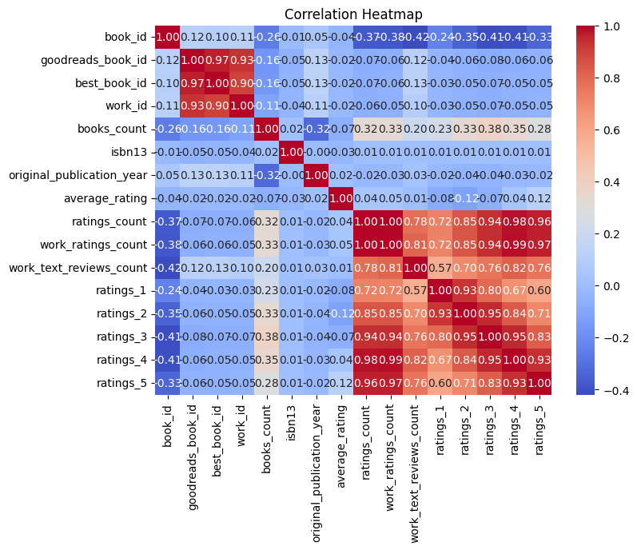
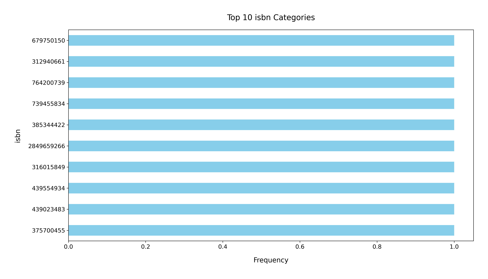

# Analysis Report

### Summary of the Dataset

The dataset contains information on 10,000 books from Goodreads, organized across 23 columns. Key attributes include book IDs, authors, publication years, average ratings, and various counts related to ratings and reviews. The dataset appears to be comprehensive, with no missing values for crucial identifiers and ratings, but notable missing values exist for ISBNs, original titles, and language codes.

### Key Insights

1. **Missing Values**:
   - The dataset has 700 missing ISBNs and 585 missing ISBN13 values, which may hinder the ability to uniquely identify books and search for them externally.
   - There are 21 missing values in the `original_publication_year` and 585 in the `original_title`, suggesting that some books lack historical publication context.

2. **Authors**:
   - A total of 4,664 unique authors are represented, with Stephen King being the most frequently listed, appearing 60 times.
   - This diversity in authors indicates a broad range of genres and styles.

3. **Publication Years**:
   - The average original publication year is approximately 1982, with a minimum year of -1750 (likely an error) and a maximum of 2017.
   - A significant number of books were published after 2000, indicating a recent trend in book publishing.

4. **Ratings and Reviews**:
   - The average rating across all books is 4.00, with a standard deviation of 0.25, suggesting that the majority of books rated on Goodreads tend to receive favorable reviews.
   - The ratings distribution indicates a strong preference for higher ratings, with the most books receiving 4 and 5-star ratings.

5. **Language**:
   - The dataset contains 25 unique language codes, with English (`eng`) being the most prevalent, accounting for 6,341 entries. This highlights the English-dominated nature of the dataset.

6. **Visual Insights**:
   - Charts illustrating the distribution of average ratings and the number of ratings per book would likely reveal a clustering around higher ratings.
   - A bar chart of the top authors by the number of books might show Stephen King's dominance in this dataset.

### Recommendations

1. **Data Cleaning**:
   - Address the missing ISBN and `original_title` values by either imputation or removal of incomplete entries to enhance data integrity.
   - Investigate the abnormal `original_publication_year` values to correct potential errors.

2. **Enhanced Metadata**:
   - Enrich the dataset with additional metadata, such as genres, to facilitate better analysis and recommendations for readers.
   - Consider adding links to author profiles or book summaries for a more comprehensive view.

3. **Analysis of Ratings**:
   - Conduct sentiment analysis on reviews to provide deeper insights into readers' perceptions beyond numerical ratings.
   - Explore correlations between publication year and average rating to see if newer publications tend to receive better reviews.

4. **Language Representation**:
   - Consider expanding the dataset to include more books in other languages to provide a broader perspective on global literature.
   - Analyze the representation of non-English books to identify gaps in the dataset.

5. **User Engagement**:
   - Engage users with visualizations of the most popular genres or authors based on ratings and reviews to encourage exploration of the dataset.

By addressing these recommendations, the dataset can provide richer insights and become a more robust resource for readers, authors, and publishers alike.

