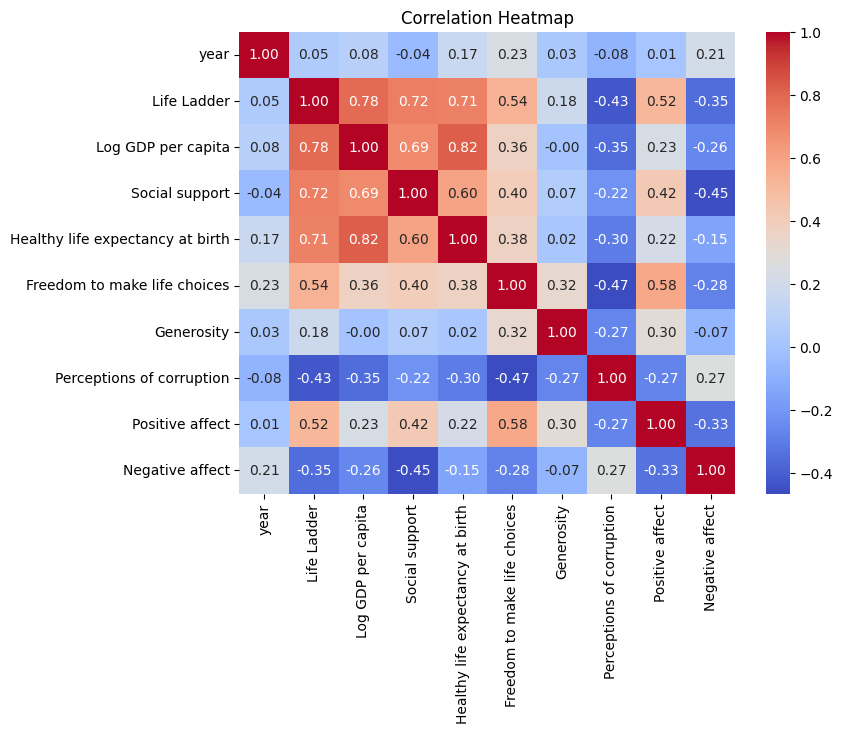
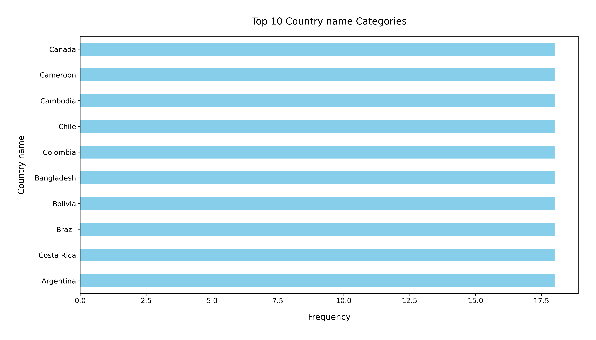

# Analysis Report

### Dataset Summary

The dataset titled **happiness.csv** consists of **2,363 entries** across **11 columns**, capturing various factors influencing happiness across different countries and years. The key columns include:

- **Country name**: Identifies the country.
- **year**: The year of the data entry.
- **Life Ladder**: A measure of subjective well-being.
- **Log GDP per capita**: The logarithm of the GDP per capita, indicating economic performance.
- **Social support**: An index measuring the support individuals can rely on in times of need.
- **Healthy life expectancy at birth**: The average number of years a newborn is expected to live in good health.
- **Freedom to make life choices**: A measure of individual freedoms.
- **Generosity**: A measure of charitable behaviors.
- **Perceptions of corruption**: The public perception of corruption in businesses and government.
- **Positive affect**: A measure of positive emotions.
- **Negative affect**: A measure of negative emotions.

### Key Insights

1. **Missing Values**: 
   - Several columns contain missing values, with **Generosity** (81), **Perceptions of corruption** (125), and **Healthy life expectancy at birth** (63) having the most significant gaps. This could affect analyses and insights drawn from these variables.

2. **Life Ladder**:
   - The average **Life Ladder** score is **5.48**, with a range from **1.281** to **8.019**, indicating varying levels of happiness among countries.

3. **Economic Factors**:
   - The mean **Log GDP per capita** is **9.40**, suggesting a generally positive economic landscape. However, the standard deviation (approximately **1.15**) indicates substantial disparities among countries.

4. **Social Support**:
   - The average score for **Social support** is **0.81**, indicating a relatively high level of perceived social support among respondents.

5. **Freedom and Happiness**:
   - The **Freedom to make life choices** averages around **0.75**, showing that many individuals feel they have a degree of autonomy, which may correlate with happiness levels.

6. **Generosity**:
   - The mean **Generosity** score is very low (**9.77e-05**), suggesting that charitable behavior may not be a significant factor in the overall happiness of most countries.

7. **Affect Measures**:
   - **Positive affect** averages **0.65**, while **Negative affect** averages **0.27**, indicating a generally positive emotional state among respondents.

### Recommendations

1. **Address Missing Data**: 
   - Prioritize filling in missing values, especially for critical variables such as **Generosity** and **Perceptions of corruption**, as they can significantly affect the analysis.

2. **Further Analysis**: 
   - Conduct correlation analyses to explore relationships between happiness (Life Ladder) and various predictors (GDP, social support, freedom, etc.) to identify key drivers of happiness.

3. **Focus on Low-Scoring Countries**: 
   - Investigate countries with low **Life Ladder** scores to understand underlying issues and develop targeted interventions to improve well-being.

4. **Promote Social Support**: 
   - Given the significance of social support, initiatives aimed at enhancing community networks and support systems may foster greater happiness.

5. **Encourage Freedom of Choice**: 
   - Policies that promote individual freedoms could enhance happiness levels, particularly in regions where this is perceived to be lacking.

6. **Monitor Trends Over Time**: 
   - Utilize the year variable to analyze trends in happiness and related factors over time, identifying shifts that may correlate with global events, policies, or economic changes.

In conclusion, while the dataset provides valuable insights into the factors influencing happiness across countries, addressing data gaps and conducting deeper analyses will yield more actionable insights for policymakers and researchers.

## Sample Data

| Country name   |   year |   Life Ladder |   Log GDP per capita |   Social support |   Healthy life expectancy at birth |   Freedom to make life choices |   Generosity |   Perceptions of corruption |   Positive affect |   Negative affect |
|:---------------|-------:|--------------:|---------------------:|-----------------:|-----------------------------------:|-------------------------------:|-------------:|----------------------------:|------------------:|------------------:|
| Afghanistan    |   2008 |         3.724 |                7.35  |            0.451 |                               50.5 |                          0.718 |        0.164 |                       0.882 |             0.414 |             0.258 |
| Afghanistan    |   2009 |         4.402 |                7.509 |            0.552 |                               50.8 |                          0.679 |        0.187 |                       0.85  |             0.481 |             0.237 |
| Afghanistan    |   2010 |         4.758 |                7.614 |            0.539 |                               51.1 |                          0.6   |        0.118 |                       0.707 |             0.517 |             0.275 |
| Afghanistan    |   2011 |         3.832 |                7.581 |            0.521 |                               51.4 |                          0.496 |        0.16  |                       0.731 |             0.48  |             0.267 |
| Afghanistan    |   2012 |         3.783 |                7.661 |            0.521 |                               51.7 |                          0.531 |        0.234 |                       0.776 |             0.614 |             0.268 |
