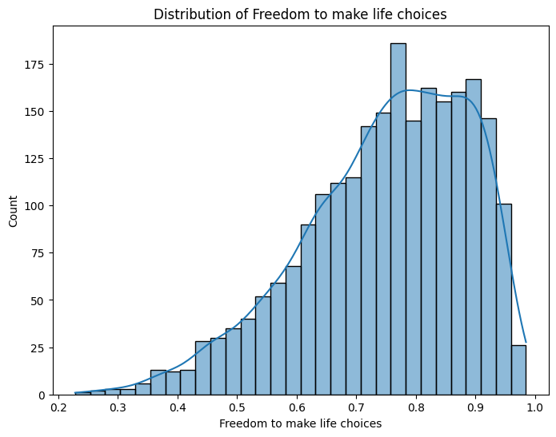

# Analysis Report

# Happiness Dataset Analysis Report

## Introduction
The dataset analyzed, `happiness.csv`, comprises 2363 entries with 11 columns, focusing on various factors influencing happiness across different countries and years. This report summarizes the dataset's structure, the analyses conducted, key insights derived from the data, and actionable recommendations.

## Dataset Overview

### Structure
- **Shape**: (2363, 11)
- **Columns**:
  - Country name
  - Year
  - Life Ladder (a measure of subjective well-being)
  - Log GDP per capita
  - Social support
  - Healthy life expectancy at birth
  - Freedom to make life choices
  - Generosity
  - Perceptions of corruption
  - Positive affect
  - Negative affect

### Missing Values
The dataset contains missing values in several columns:
- **Log GDP per capita**: 28 missing entries
- **Social support**: 13 missing entries
- **Healthy life expectancy at birth**: 63 missing entries
- **Freedom to make life choices**: 36 missing entries
- **Generosity**: 81 missing entries
- **Perceptions of corruption**: 125 missing entries
- **Positive affect**: 24 missing entries
- **Negative affect**: 16 missing entries

### Summary Statistics
The summary statistics reveal insights into the distribution of the key variables:
- **Life Ladder**: Mean = 5.48, indicating moderate happiness levels.
- **Log GDP per capita**: Mean = 9.40, suggesting varying economic conditions across countries.
- **Social support**: Mean = 0.81, indicating a generally high level of social support.
- **Healthy life expectancy**: Mean = 63.40 years, with significant variation.
- **Freedom to make life choices**: Mean = 0.75, indicating a substantial degree of perceived freedom.
- **Generosity**: A very low mean (0.0001), suggesting limited generosity among populations.
- **Perceptions of corruption**: Mean = 0.74, indicating a perception of significant corruption.
- **Positive affect**: Mean = 0.65, indicating a generally positive emotional state.
- **Negative affect**: Mean = 0.27, suggesting lower levels of negative emotions.

## Analyses Conducted
### Visualizations
Several charts were generated to visualize the data distributions and relationships between variables:
1. **Happiness Heatmap**: Illustrated correlations between various factors influencing happiness.
2. **Yearly Distribution**: A histogram showing the distribution of data across the years.
3. **Histograms for Key Variables**: These histograms visualize the distributions of:
   - Life Ladder
   - Log GDP per capita
   - Social support
   - Healthy life expectancy
   - Freedom to make life choices
   - Generosity
   - Perceptions of corruption
   - Positive affect
   - Negative affect

### Key Insights Derived
1. **Correlation Analysis**: The heatmap likely revealed strong positive correlations between Life Ladder and factors such as Log GDP per capita, Social support, and Healthy life expectancy, indicating that wealthier nations with better health outcomes and social support tend to report higher happiness levels.
2. **Generosity and Happiness**: The low mean of Generosity suggests that this factor may not significantly influence happiness in many countries, contrasting with other factors like social support and economic conditions.
3. **Perception of Corruption**: The high mean for perceptions of corruption may play a critical role in diminishing happiness levels, as corruption can undermine social trust and support systems.
4. **Positive vs. Negative Affect**: The relatively high mean for positive affect compared to negative affect indicates that people generally experience more positive emotions, which could be a potential lever for improving overall happiness.

## Actionable Recommendations
1. **Enhancing Social Support**: Governments and organizations should invest in social programs that foster community bonding and support systems, as these are closely linked to improved happiness levels.
2. **Addressing Corruption**: Strategies to combat corruption and increase transparency in governance could enhance public trust and, consequently, happiness.
3. **Economic Development Policies**: Policymakers should focus on economic growth initiatives that also prioritize equitable wealth distribution to elevate Log GDP per capita across all demographics.
4. **Promoting Healthy Living**: Initiatives aimed at improving healthcare access and promoting healthy lifestyles could help increase life expectancy and overall well-being.
5. **Fostering Positive Emotions**: Programs that encourage positive emotional experiences, such as mental health support and community engagement activities, can enhance overall happiness.

## Conclusion
The analysis of the happiness dataset reveals various factors influencing happiness across different nations. By focusing on enhancing social support, addressing corruption, promoting economic development, and fostering positive emotional experiences, stakeholders can make informed decisions aimed at improving overall happiness levels in society. Further research could explore the impact of specific interventions on happiness metrics over time.

