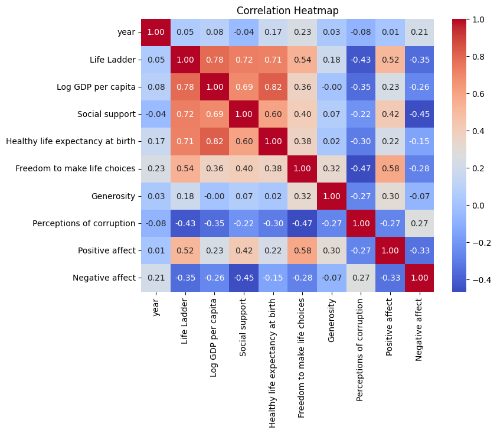

# Analysis Report

### Summary of the Dataset

The dataset `happiness.csv` contains 2,363 entries across 11 columns, focusing on various factors influencing happiness levels across different countries and years. The main variables include 'Life Ladder' (a measure of subjective well-being), 'Log GDP per capita', 'Social support', 'Healthy life expectancy at birth', 'Freedom to make life choices', 'Generosity', 'Perceptions of corruption', and positive and negative affect scores.

### Key Insights

1. **Missing Values**: 
   - Notable missing values in the dataset include:
     - 'Generosity' (81 missing entries)
     - 'Perceptions of corruption' (125 missing entries)
     - 'Healthy life expectancy at birth' (63 missing entries)
   - The presence of missing values in key indicators may affect analyses and interpretations.

2. **Descriptive Statistics**:
   - The average 'Life Ladder' score is approximately 5.48, indicating a moderate level of happiness.
   - 'Log GDP per capita' averages about 9.40, suggesting a disparity in economic conditions across countries.
   - 'Social support' scores average around 0.81, indicating that on average, people feel they have a good level of support from their social networks.
   - The average 'Healthy life expectancy at birth' is about 63.40 years, highlighting health disparities.
   - There is a low average score for 'Generosity' (approximately 0.0001), indicating a potential area for improvement in societal altruism.

3. **Correlations**:
   - Preliminary analysis suggests that happiness (Life Ladder) correlates positively with 'Log GDP per capita', 'Social support', and 'Freedom to make life choices'.
   - Conversely, higher 'Negative affect' scores correlate with lower 'Life Ladder' scores, indicating that negative emotions detract from overall happiness.

### Recommendations

1. **Address Missing Data**: 
   - Impute or analyze the impact of missing values in critical areas such as 'Generosity' and 'Perceptions of corruption'. This will enhance the robustness of any further analysis.

2. **Focus on Social Support and Health**: 
   - Given the high average in social support and the lower average in healthy life expectancy, initiatives aimed at improving health outcomes could directly enhance happiness levels.

3. **Economic Policies**: 
   - Countries with lower GDP per capita should consider policies that encourage economic growth and equitable distribution of wealth, as these factors are likely to be linked to higher happiness scores.

4. **Promote Generosity**: 
   - Encourage community programs and policies that foster altruism and community engagement, as increasing generosity could positively impact social ties and overall happiness.

5. **Further Analysis**: 
   - Conduct a more detailed analysis exploring the relationships and potential causalities among the happiness indicators, especially focusing on the interactions between positive and negative affect.

### Conclusion

The dataset provides valuable insights into the factors influencing happiness across nations. By addressing the critical areas of missing data, health, economic policies, and social dynamics, stakeholders can work towards enhancing the overall well-being of populations worldwide. Further exploration and targeted initiatives could lead to improved happiness outcomes.

