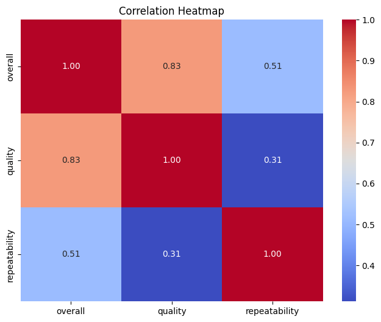
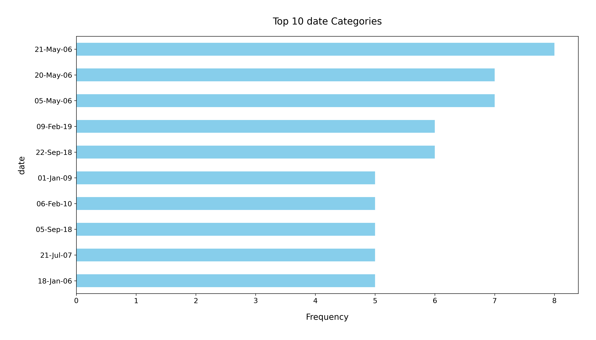

# Analysis Report

### Summary of the Dataset

The dataset, **media.csv**, consists of **2,652 entries** and **8 columns** that provide information on various media items. The key columns include:

- **date**: The release date of the media.
- **language**: The language in which the media is produced.
- **type**: The category of media (e.g., movie, series).
- **title**: The name of the media.
- **by**: The person or entity that created the media.
- **overall**: A rating scale from 1 to 5 representing overall satisfaction.
- **quality**: A rating scale from 1 to 5 representing quality assessment.
- **repeatability**: A rating scale from 1 to 3 indicating how often the media can be revisited.

### Key Insights

1. **Missing Values**:
   - The **date** column has **99 missing values**, which may need addressing for time-based analyses.
   - The **by** column has **262 missing values**, which could impact analyses related to creators or contributors.

2. **Language Distribution**:
   - The dataset contains **11 unique languages**, with **English** being the most prevalent (1,306 occurrences). This indicates a strong bias towards English media.

3. **Type of Media**:
   - The majority of entries are classified as **movies** (2,211 occurrences), suggesting that the dataset is heavily focused on this type of media.

4. **Rating Analysis**:
   - The average **overall rating** is approximately **3.05**, indicating a moderate level of satisfaction among users.
   - The average **quality rating** is around **3.21**, suggesting that while users find the content acceptable, there is room for improvement.
   - The **repeatability** rating averages **1.49**, indicating that most media is not frequently revisited.

5. **Creator Popularity**:
   - The most frequent creator is **Kiefer Sutherland**, with **48 entries**. This suggests that certain creators are more prominent within the dataset.

### Recommendations

1. **Address Missing Values**:
   - Investigate the missing values in the **date** and **by** columns. Consider filling these gaps through data imputation techniques or by dropping incomplete records if they significantly impact analyses.

2. **Enhance Diversity**:
   - To improve the dataset's richness, consider including more entries from underrepresented languages and media types. This can provide a more comprehensive view of media offerings.

3. **Quality Improvement**:
   - Given that the overall and quality ratings are moderate, it would be beneficial for media producers to analyze feedback and enhance content quality and viewer satisfaction.

4. **Engagement Strategies**:
   - Since the repeatability score is low, media creators could explore ways to enhance viewer engagement, such as creating sequels or spin-offs, or implementing marketing strategies that encourage rewatching.

5. **Further Analysis**:
   - Conduct additional analyses such as time-series analysis on media release dates to identify trends over time, or correlations between ratings and media types to guide future content development.

By addressing these recommendations and insights, stakeholders can make informed decisions to improve media offerings and enhance viewer satisfaction.

