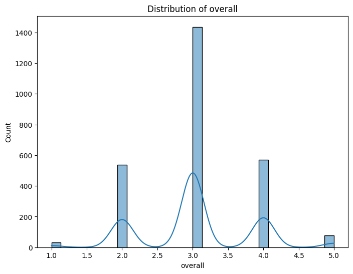

# Analysis Report

# Media Dataset Analysis Report

## Dataset Overview

The dataset, `media.csv`, consists of 2,652 entries across 8 columns. Each row in the dataset represents an individual media item, with details about its date of release, language, type, title, author, and various ratings. The columns in the dataset are:

- **date**: The release date of the media.
- **language**: The language in which the media is presented.
- **type**: The type of media (e.g., movie, series).
- **title**: The title of the media.
- **by**: The creator or author of the media.
- **overall**: A rating reflecting the overall quality of the media.
- **quality**: A rating that assesses the quality of the media.
- **repeatability**: A rating indicating how likely the media is to be re-watched.

### Missing Values

The dataset contains missing values in the following columns:

- **date**: 99 missing values (approx. 3.73% of the dataset).
- **by**: 262 missing values (approx. 9.87% of the dataset).
- All other columns do not have any missing entries.

### Summary Statistics

The summary statistics for the dataset reveal the following:

- **Date**: Contains 2,553 valid entries with 2,055 unique dates; the most frequent date is '21-May-06', occurring 8 times. 
- **Language**: Represents 11 unique languages with English being the most common, appearing 1,306 times.
- **Type**: Comprises 8 unique types, with 'movie' being the most prevalent, recorded 2,211 times.
- **Title**: There are 2,312 unique titles, with 'Kanda Naal Mudhal' as the most frequently listed title, appearing 9 times.
- **By**: 2,390 valid entries, 1,528 unique creators; 'Kiefer Sutherland' is the most frequent creator, credited 48 times.
- **Overall Rating**: The mean rating is approximately 3.05 (out of 5), with a standard deviation of 0.76. Ratings range from 1 to 5.
- **Quality Rating**: The mean is approximately 3.21, with a standard deviation of 0.80. Ratings also range from 1 to 5.
- **Repeatability Rating**: The average is about 1.49, with a standard deviation of 0.60, and ranges from 1 to 3.

## Visual Analyses

The following charts were generated to visualize key aspects of the dataset:

1. **Heatmap (media_heatmap.png)**: This chart provides a visual representation of correlations between the numerical attributes (i.e., overall, quality, and repeatability ratings). 

2. **Overall Rating Histogram (media_overall_hist.png)**: This histogram illustrates the distribution of overall ratings, indicating a concentration of ratings around 3. 

3. **Quality Rating Histogram (media_quality_hist.png)**: Similar to the overall rating, this histogram shows that quality ratings also cluster around the 3-4 range, suggesting a tendency towards average to good quality.

4. **Repeatability Rating Histogram (media_repeatability_hist.png)**: This histogram reveals that most entries are rated as 1, indicating that media items are not frequently re-watched.

## Key Insights

- **Language Distribution**: The dominance of English suggests that media targeting this language group may have a larger audience and could be a focal point for further content development.
  
- **Type Analysis**: The prevalence of movies indicates a strong preference for this media type. Exploration into other types could reveal new opportunities, such as series or documentaries, which currently have less representation.

- **Rating Trends**: The overall and quality ratings clustering around 3 suggests that while media is generally perceived positively, there is room for improvement. Enhancing content quality could lead to higher audience satisfaction and repeatability.

- **Creator Popularity**: The concentration of media created by a few individuals (e.g., Kiefer Sutherland) points to potential partnerships or marketing strategies that could leverage these popular creators to promote new media.

## Recommendations

1. **Focus on Quality Improvement**: Given the average ratings hover around 3, efforts should be made to enhance media quality. This could involve increasing production values, investing in storytelling, or incorporating audience feedback.

2. **Expand Language Offerings**: With a significant percentage of content in English, consider diversifying content in underrepresented languages to capture a broader audience and cater to multi-lingual viewers.

3. **Explore Diverse Media Types**: Investigate the potential for producing more diverse types of media (e.g., series, documentaries) to meet varying audience preferences.

4. **Leverage Popular Creators**: Utilize the popularity of certain creators to market new media effectively. Collaborations with these individuals could enhance visibility and drive viewership.

5. **Engage with Viewers**: Conduct surveys or focus groups to gather direct feedback from viewers about what they enjoy and what they would like to see improved. This engagement can guide future content strategies.

## Conclusion

The analysis of the `media.csv` dataset reveals valuable insights into audience preferences and media performance. By focusing on quality enhancement, expanding language diversity, exploring new media types, leveraging popular creators, and engaging with viewers, media producers can increase audience satisfaction and potentially boost viewership and repeatability of their content.

